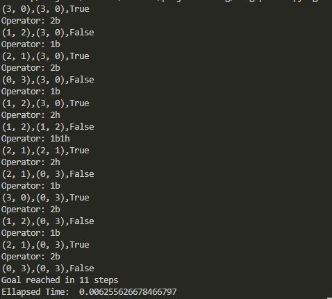

# State Space Search

State space search is a general approach that can be applied to any problem domain that is deterministic, discrete, and static. In this project, it's applied to a problem we call Borg and Crew puzzle. More info can be found below about it.

## Borg and Crew 

This problem is a remix of the "Missionaries and Cannibals" problem that famous in AI because it was the subject of one of the [first papers](https://www.jstor.org/stable/pdf/3619658.pdf) that approached problem formation in a formal way.  It has its roots in the "Jealous Husbands" problem that dates to as far back as 800AD!  But let's modernize this a little bit:

Exactly Three (3) Members of the Federation and of Three (3) Borg find themselves isolated on a strange planet, and despite being enemies, have reached a temporary truce so they can return back to their ships.  However, there is a river in the way, along with a boat that can hold either one or two people. Find a way to get everyone to the other side of the river, without ever leaving a group of humans on either of the river outnumbered by the Borg (lest they become assimilated in to the Borg Hive Mind).

## Part 1: Improving Search 

After improving the orignal search function by memoization, significant speed up's happen when printing out verbosely, implying many less iterations are taking place.

After running on the pitcher problem,

The unoptimized search ran for approximately:0.797 Seconds
Whereas, the improvedSearch ran for approximately: 0.015 Seconds

Running it on the borg puzzle also gave similar results,

The unoptimized search ran for approximately:0.008 Seconds
Whereas, the improvedSearch ran for approximately: 0.007 Seconds

Giving this simple change an approx. 98% speedup in the default setup of the pitcher problem
and about 12.5% speedup in the default setup of the borg problem. 
## Example Runtime

Below is the search algorithms successful path to a goal state where all the borgs and humans have made it to the other side 

